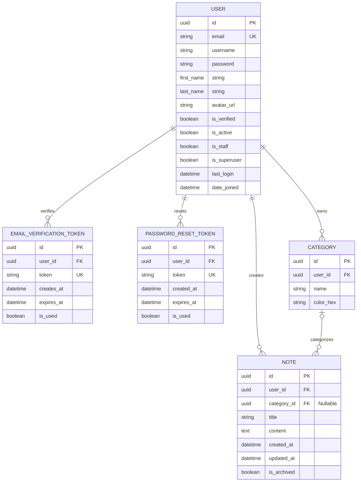

# 🔗 Database Schema - Entity Relationship Diagram

## 🎯 OVERVIEW

This is the complete database schema for Swiftnote application with authentication, email verification, password reset, categories, and notes.

## 📊 ERD DIAGRAM

---

## 🔑 KEY RELATIONSHIPS

- **User to EmailVerificationToken**: One-to-Many (1:N) - A user can have multiple verification tokens over time, but each token belongs to one user.
- **User to PasswordResetToken**: One-to-Many (1:N) - A user can request multiple password resets, but each token is associated with one user.
- **User to Category**: One-to-Many (1:N) - A user can create multiple categories, but each category belongs to one user.
- **User to Note**: One-to-Many (1:N) - A user can create multiple notes, but each note belongs to one user.
- **Category to Note**: One-to-Many (1:N) - A category can  contain multiple notes, but each note can belong to only one category (or none).

---
