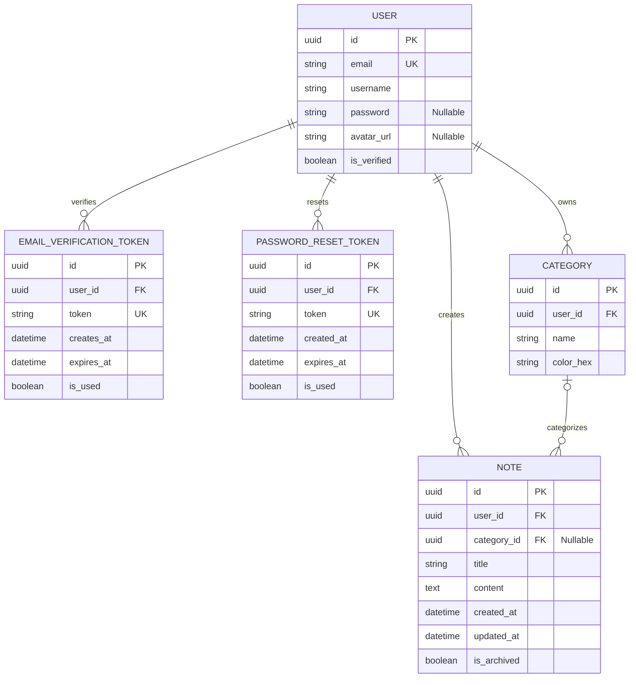

# 🔗 Database Schema - Entity Relationship Diagram

## 🎯 OVERVIEW

This is the complete database schema for Swiftnote application with authentication, email verification, password reset, categories, and notes.

## 📊 ERD DIAGRAM

## 📋 TABLE DESCRIPTIONS

### 👤 User Table

| Field       | Type        | Description / Constraints                            |
|-------------|------------ |------------------------------------------------------|
| id          | UUID (PK)   | Unique identifier for every user.                    |
| email       | String      | Unique; used for login and notifications.            |
| username    | String      | User's display name.                                 |
| password    | String      | Hashed; nullable for Google OAuth users.             |
| avatar_url  | String      | Nullable; storage for profile picture URL.           |
| is_verified | Boolean     | Tracks if the user has completed email verification. |

---

### 📧 EmailVerificationToken Table

| Field      | Type       | Description / Constraints                             |
|------------|------------|-------------------------------------------------------|
| id         | UUID (PK)  | Unique identifier for the token record.               |
| user_id    | FK (User)  | Links the token to a specific user account.           |
| token      | String     | Unique, secure string sent in the verification email. |
| creates_at | DateTime   | Used to calculate if the token has expired.           |
| expires_at | DateTime   | Enforces a time limit on the verification link.       |
| is_used    | Boolean    | Prevents the link from being used more than once.     |

---

### 🔐 PasswordResetToken Table

| Field      | Type      | Description / Constraints                         |
|------------|-----------|---------------------------------------------------|
| id         | UUID (PK) | Unique identifier for the token record.           |
| user_id    | FK (User) | Identifies which user is requesting the reset.    |
| token      | String    | Unique string used to validate the reset request. |
| creates_at | DateTime  | Used to calculate if the token has expired.       |
| expires_at | DateTime  | Enforces a time limit on the verification link.   |
| is_used    | Boolean   | Prevents the link from being used more than once. |

---

### 📁 Category Table

| Field     | Type      | Description / Constraints                        |
|-----------|-----------|--------------------------------------------------|
| id        | UUID (PK) | Unique identifier for the category.              |
| user_id   | FK (User) | Ensures categories are private to the creator.   |
| name      | String    | Name of the category (e.g., "Work", "Personal"). |
| color_hex | String    | Hex code for visual organization.                |

---

### 📝 Note Table

| Field       | Type          | Description / Constraints                                 |
|-------------|---------------|-----------------------------------------------------------|
| id          | UUID (PK)     | Unique identifier for the note.                           |
| user_id     | FK (User)     | Links the note to its owner.                              |
| category_id | FK (Category) | Nullable; allows assigning one category per note.         |
| title       | String        | The title of the sticky note.                             |
| content     | Text          | The body text of the note.                                |
| created_at  | DateTime      | Auto-generated; used for time filters (Today/Week/Month). |
| updated_at  | DateTime      | Timestamp for the last modification.                      |
| is_archived | Boolean       | Allows users to hide notes without deleting them.         |

---

## 🔑 KEY RELATIONSHIPS

- **User to EmailVerificationToken**: One-to-Many (1:N) - A user can have multiple verification tokens over time, but each token belongs to one user.
- **User to PasswordResetToken**: One-to-Many (1:N) - A user can request multiple password resets, but each token is associated with one user.
- **User to Category**: One-to-Many (1:N) - A user can create multiple categories, but each category belongs to one user.
- **User to Note**: One-to-Many (1:N) - A user can create multiple notes, but each note belongs to one user.
- **Category to Note**: One-to-Many (1:N) - A category can  contain multiple notes, but each note can belong to only one category (or none).

---
